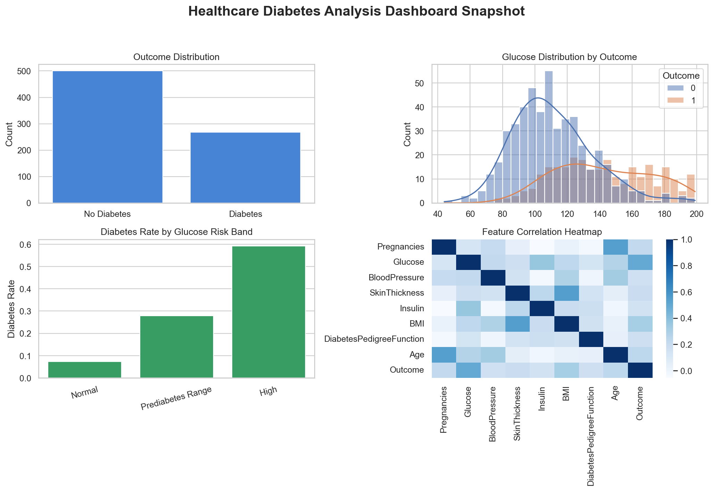

# Healthcare Diabetes ML Analytics


Graduate-level healthcare analytics portfolio project for diabetes risk analysis, data validation, supervised machine learning, interpretability, and interactive patient-level risk scoring.

[Deploy on Streamlit Cloud](https://share.streamlit.io/deploy?repository=https://github.com/manav252/healthcare-diabetes-analysis&branch=main&mainModule=app.py) | [GitHub Repository](https://github.com/manav252/healthcare-diabetes-analysis)

> This project is for education and portfolio demonstration only. It is not a medical device and must not be used for diagnosis.

## Project Overview

Healthcare teams need reliable, interpretable ways to understand diabetes risk indicators such as glucose, BMI, blood pressure, insulin, age, pregnancies, and family-history proxy variables. This project turns a classic structured diabetes dataset into an end-to-end data science solution with:

- data quality validation
- reusable preprocessing pipelines
- multi-model classification benchmarking
- hyperparameter tuning
- calibration and threshold optimization for recall-sensitive screening
- subgroup performance analysis across clinically meaningful groups
- model evaluation artifacts
- global, local, and optional SHAP interpretability helpers
- Streamlit dashboard for recruiters and stakeholders

## Problem Statement

Predict whether a patient record is associated with a diabetes outcome while clearly explaining the data quality assumptions, clinical risk factors, model performance, limitations, and practical healthcare interpretation.

## Dataset

The dataset is stored in `data/diabetes.csv` and contains 768 patient records.

| Column | Description |
| --- | --- |
| Pregnancies | Number of pregnancies |
| Glucose | Plasma glucose concentration |
| BloodPressure | Diastolic blood pressure |
| SkinThickness | Triceps skin fold thickness |
| Insulin | 2-hour serum insulin |
| BMI | Body mass index |
| DiabetesPedigreeFunction | Family-history risk proxy |
| Age | Patient age |
| Outcome | Binary diabetes outcome |

Raw data quality findings:

- Missing values: 0
- Duplicate rows: 0
- Invalid clinical zeros exist in glucose, blood pressure, skin thickness, insulin, and BMI
- Class balance: 500 non-diabetes outcomes and 268 diabetes outcomes

## Architecture

```text
.
├── app.py                         # Backward-compatible Streamlit entry point
├── dashboard/
│   └── app.py                     # Dashboard pages and interactive UI
├── data/
│   └── diabetes.csv               # Raw dataset
├── docs/                          # Architecture, methodology, findings
├── models/                        # Saved model artifacts
├── notebooks/
│   └── health_care_project.py     # Original EDA script
├── reports/
│   ├── insights.md                # Healthcare and business interpretation
│   ├── data_quality_report.md     # Generated validation report
│   ├── model_comparison.csv       # Generated model metrics
│   ├── threshold_analysis.csv     # Recall-sensitive threshold analysis
│   ├── subgroup_performance.csv   # Fairness and subgroup performance
│   └── figures/                   # Generated evaluation plots
├── scripts/
│   └── train_model.py             # End-to-end training pipeline
├── src/
│   ├── data_processing.py
│   ├── evaluation.py
│   ├── external_validation.py
│   ├── feature_engineering.py
│   ├── interpretability.py
│   ├── modeling.py
│   ├── prediction.py
│   ├── preprocessing.py
│   ├── utils.py
│   ├── validation.py
│   └── visualization.py
└── tests/
```

## Machine Learning Workflow

1. Load raw data.
2. Validate schema, missing values, duplicates, invalid zeros, data types, and outliers.
3. Convert clinically invalid zeros to missing values.
4. Split features and target with stratified train/test sampling.
5. Impute missing values inside sklearn pipelines to avoid leakage.
6. Scale numeric features for Logistic Regression.
7. Train and compare:
   - Logistic Regression
   - Decision Tree
   - Random Forest
   - Gradient Boosting
   - XGBoost when installed
   - Tuned Random Forest
8. Select the best model by ROC-AUC.
9. Generate calibration, threshold, subgroup, and optional SHAP reports.
10. Save the best model and evaluation plots.

## Evaluation

The training pipeline generates:

- Accuracy
- Precision
- Recall
- F1-score
- ROC-AUC
- Confusion matrix
- ROC curve
- Precision-recall curve
- Calibration curve
- Threshold optimization table
- Subgroup performance table
- Model comparison table
- Global feature importance
- Optional SHAP summary plot when SHAP supports the fitted estimator

Run the full pipeline:

```bash
python scripts/train_model.py
```

Generated outputs are written to `reports/` and `models/`.

## Dashboard

Run:

```bash
streamlit run app.py
```

Dashboard sections:

- Dataset Overview
- EDA
- Risk Insights
- Patient Prediction
- Feature Importance
- Thresholds
- Subgroups
- Model Performance
- About Project



## Business Insights

- Glucose is the strongest practical risk signal in the dataset.
- BMI, age, pregnancies, and diabetes pedigree function provide useful supporting context.
- Invalid zero values in clinical measurements materially affect downstream analysis and must be handled before modeling.
- Model outputs are best interpreted as triage-style risk signals for education, not clinical decisions.

See `reports/insights.md` for the full interpretation.

## Public Demo Deployment

The project is ready for Streamlit Community Cloud. Deploy it here:

[Deploy on Streamlit Cloud](https://share.streamlit.io/deploy?repository=https://github.com/manav252/healthcare-diabetes-analysis&branch=main&mainModule=app.py)

Use these settings if Streamlit asks for them:

- Repository: `manav252/healthcare-diabetes-analysis`
- Branch: `main`
- Main file path: `app.py`

After Streamlit creates the app, copy the generated public `*.streamlit.app` URL and replace the deploy button above with the live demo link.

## Installation

```bash
git clone https://github.com/manav252/healthcare-diabetes-analysis.git
cd healthcare-diabetes-analysis
python -m venv .venv
source .venv/bin/activate
pip install -r requirements.txt
```

## Testing

```bash
pytest -q
python -m py_compile src/*.py dashboard/*.py scripts/*.py app.py notebooks/*.py
```

## Documentation

- `PROJECT_AUDIT.md`: repository audit and prioritized improvement plan
- `docs/architecture.md`: system structure
- `docs/methodology.md`: validation, preprocessing, modeling, and interpretability approach
- `reports/insights.md`: healthcare-oriented findings
- `reports/data_quality_report.md`: generated validation output
- `reports/threshold_analysis.csv`: recall-sensitive screening thresholds
- `reports/subgroup_performance.csv`: age and BMI subgroup performance
- `docs/deployment.md`: public Streamlit deployment steps

## Future Work

- Add a real newer external clinical dataset once one is approved for public use.
- Add model monitoring and drift checks after public deployment.
- Add CI-rendered dashboard screenshots after the app is hosted.
