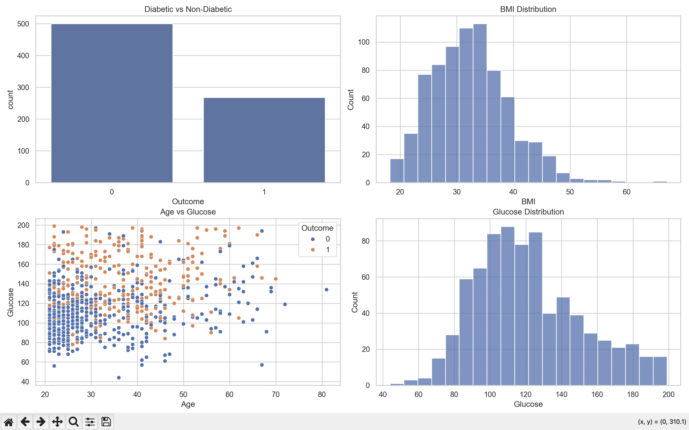

# Healthcare Diabetes Analysis


Healthcare EDA project analyzing diabetes risk indicators using Python, Pandas, Matplotlib, and Seaborn.

## Problem Statement

Diabetes risk is influenced by clinical indicators such as glucose, BMI, insulin, age, and blood pressure. This project explores a diabetes dataset to identify patterns associated with diabetes outcomes and communicate health-related insights clearly.

## Dataset / Source

The dataset is stored in `data/diabetes.csv` and contains medical attributes such as pregnancies, glucose, blood pressure, skin thickness, insulin, BMI, diabetes pedigree function, age, and outcome.

## Tech Stack

- Python
- Pandas
- NumPy
- Matplotlib
- Seaborn
- Scikit-learn-ready structure

## Workflow

1. Load diabetes dataset.
2. Replace invalid zero values in medical columns.
3. Create risk bands for glucose and BMI.
4. Perform exploratory data analysis.
5. Visualize outcome distribution, BMI, age, and glucose.

## Methodology

- Invalid zero values are replaced with median values for relevant medical measurements.
- EDA focuses on glucose, BMI, age, insulin, and diabetes outcome.
- Visualizations support interpretation of risk patterns.

## Key Features

- Medical data cleaning
- Risk band feature engineering
- Outcome distribution
- BMI and glucose analysis
- Screenshot artifact in `screenshots/`

## Results / Insights

- Higher glucose values are strongly associated with diabetic outcomes.
- BMI and age help identify higher-risk groups.
- Cleaning invalid zero values improves the reliability of EDA.

## Screenshots



## How to Run Locally

```bash
pip install -r requirements.txt
python notebooks/health_care_project.py
pytest -q
```

## Folder Structure

```text
.
├── data/
├── docs/
├── notebooks/
├── reports/
├── screenshots/
├── src/
├── tests/
├── README.md
└── requirements.txt
```

## Future Improvements

- Add Logistic Regression or Random Forest diabetes outcome classification.
- Add ROC curve, confusion matrix, and feature importance.
- Add a Streamlit dashboard for healthcare analytics.
